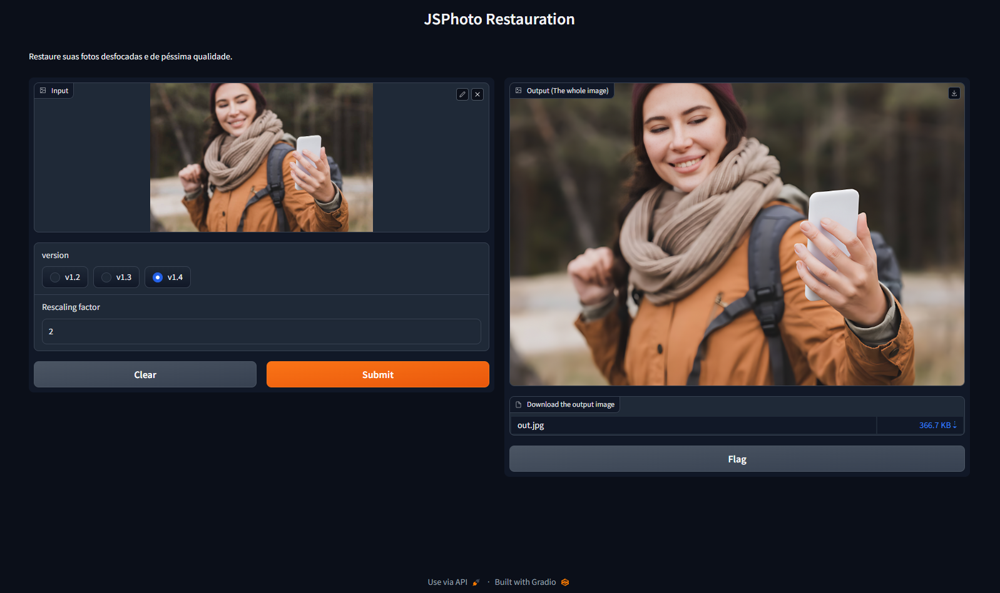

#JSPhoto Resturation

Restaura suas fotos borradas. com esse incrivel algoritimo de inteligencia artifical que reconstroi seu rosto usando inteligencia artificial.

#### Importação da Biblioteca jwc-components.js
Importe via CDN ou NPM 
```Terminal
pip install -r requirements.txt
```


#### Rodar App com interface Gradio
Crie um localhost com interface gradio para testar a aplicação.

```Terminal
python app-gradio.py
```


Caso deseje usar em forma de API segue o codigo abaixo. lembrando para usar em forma de API primeiro teste o app em gradio para baixar os requesitos.

```Terminal
python rest-api.py
```

#### Como Solicitar. 
url: http://exemplo.com/reconstruir

paramentros: ---------------
```json
token: "api_key_abcd" // token definido no arquivo rest-api.py na linha 86
version: 1.4v //versão do modelo.
scale: 2 //escalatura da image exemplo qualidade quanto maior a escala mais qualidade a fodo fica mas tambem consome muito da sua gpu ou cpu
imagem: // envie a image como multpart form data.
```


## Exemplo de Uso




Nosso Site [jsaplication.com.br](https://jsaplication.com.br)
